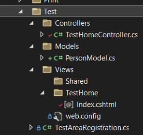

[Good ASP.NET MVC beginners guide](https://youtu.be/E7Voso411Vs)

**MVC** - model, view, controller

**Model** - application data

**View** - the HTML markup that we display to the user

**Controller** - responsible for handling an HTTP request

**Router** - selects the right controller to handle request

---
`/App_Start/RouteConfig.cs` - default routing. Order of routs matters. From most *specific* to most *generic*.
```csharp
routes.MapRoute(
    name: "default",
    url: "{controller}/{action}/{id}",
    defaults: new { controller = "Home", action = "Index", id = UrlParameter.Optional},
    constraints: new { id = @"\d{4}"}//Regex for id parameter
);
```

`/Views/` - by convention has subfolders with the same name as the controller (without controller word) to store its views.

`packages.config` - NuGet package manager configuration

`Web.config` - connection strings, app settings and other configuration

---
Basic [model](PersonModel.cs), [view](Index.cshtml), [controller](TestHomeController.cs)



`/App_Start/BundleConfig.cs` - configures bundles of ccs and/or js files for web optimization.

1. [Controller](Controller.md)
2. [Razor View](RazorView.md)
3. [Partial view](PartialView.md)